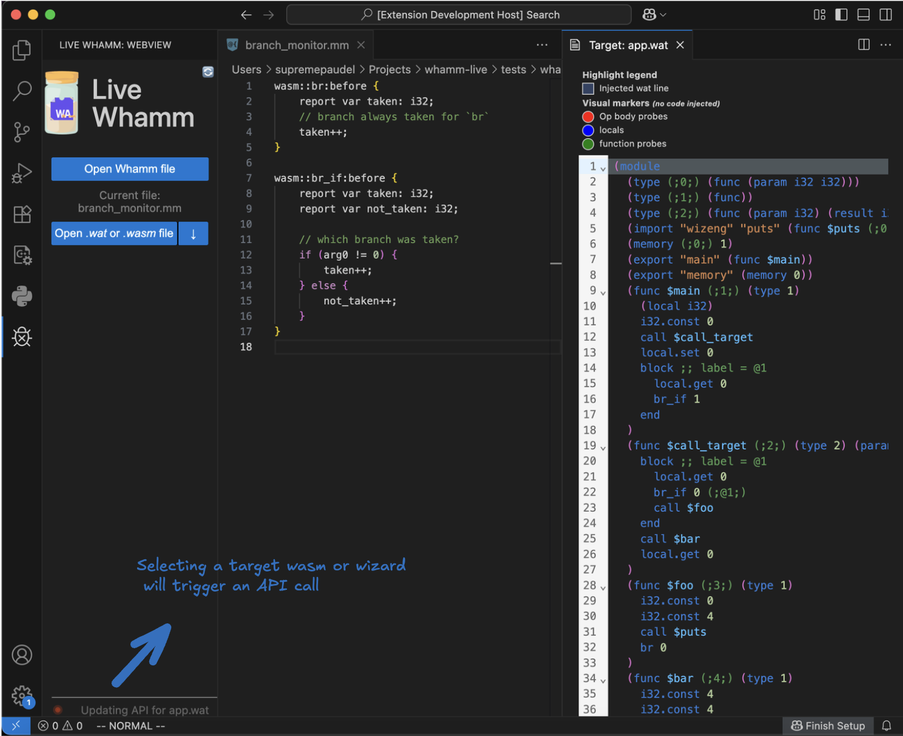
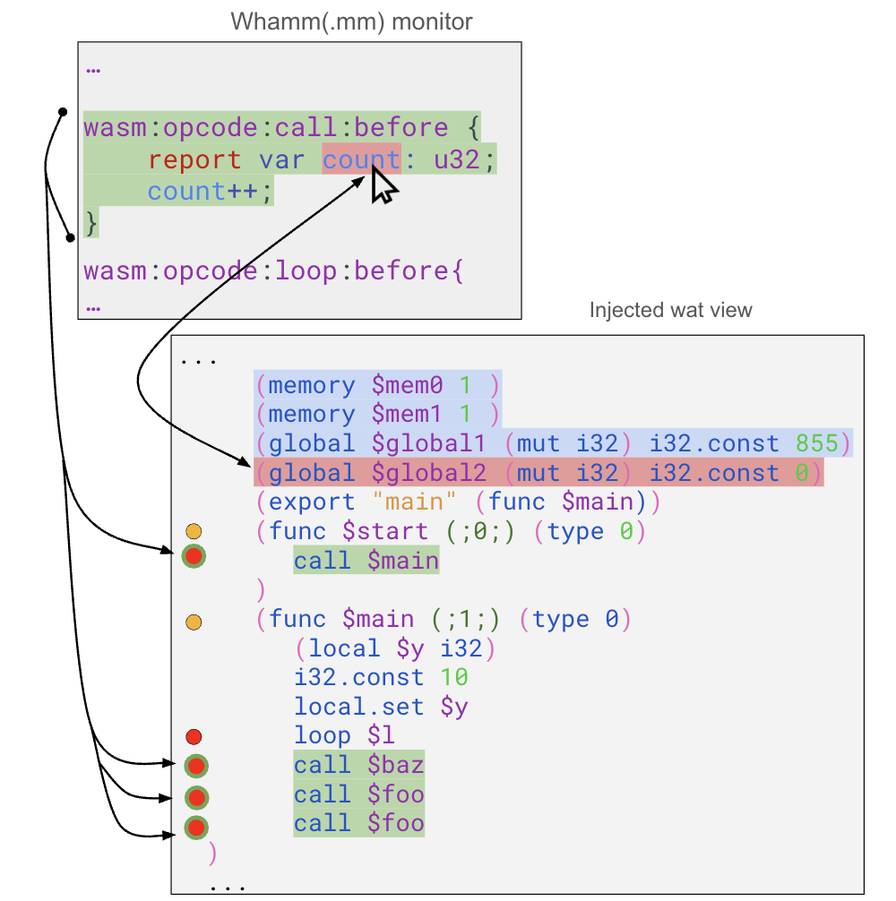
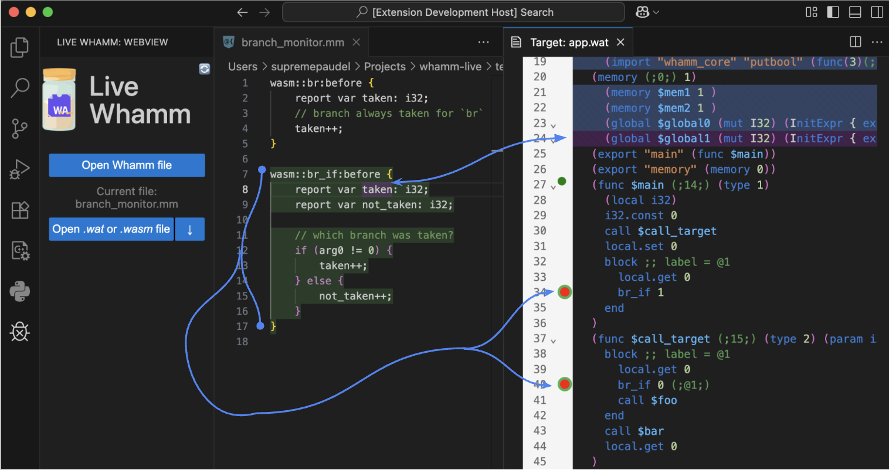
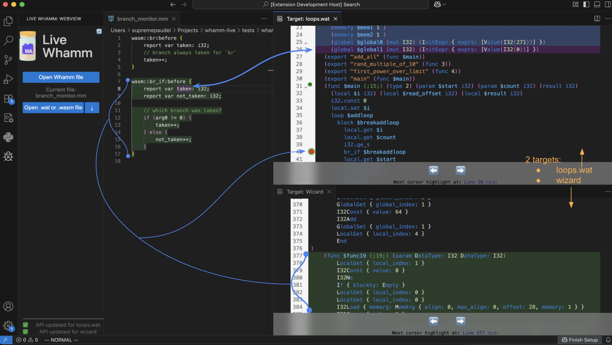
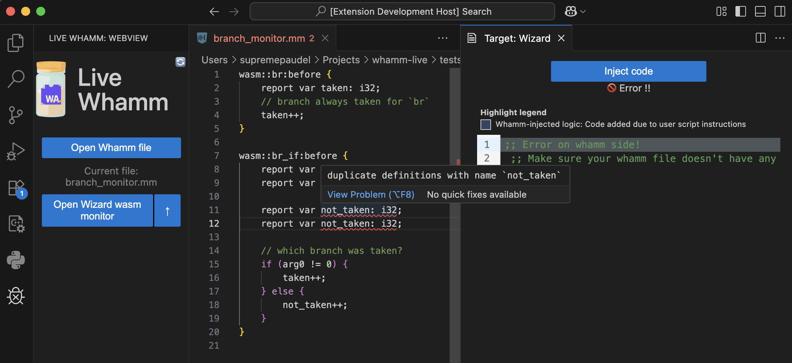

<b>Note</b>: A good guide is available in this [Live Whamm demo video](https://www.youtube.com/watch?v=RmWPOX-mJ4g) on YouTube which would be a great resource to get started!

## Getting started
To begin using Live Whamm, open the extension from the activity bar on the left-hand side of VSCode. Look for the Live Whamm icon: . Clicking it opens the Live Whamm panel. From here:

* Click “Open Whamm File”
    Select your Whamm monitor script (`.mm`) that defines the instrumentation logic.
     
* Choose Your Target:
    After loading the Whamm script, you can select the wasm application target(s). Alternatively, you can target the Wizard engine.
     
* Behind the Scenes:
    Once a target is selected, the extension calls the Whamm API and builds the relevant models. This process is automatic.

Here is a screenshot from VSCode:

## Targeting `wasm`
Once you've selected your target `wasm` and clicked the "Inject Code" button, Live Whamm performs a dry instrumentation and displays the new `wat` content in the webview.

> [!TIP]
> We recommend having this webview view side-by-side with your `.mm` file. This layout would be most helpful to see both the injection logic and its effects at the same time.

> [!NOTE]  
> Live Whamm performs a dry run i.e the selected `wasm` target is not actually modified. This visualization is purely for inspection and understanding.

The new injections are highlighted in blue. Note that, the `func probe`, `op body probe` and `local` injections are not inserted as actual lines in the injected `wat`. Instead, they appear as visual circles beside the relevant code locations, helping you understand their placement without cluttering the code. Hovering over these visuals will show the `wat` code associated with the injection!

Moreover, you’ll notice a legend in the webview interface that explains the color and symbol coding for different types of injections. Here is a summary:

### Using Live Whamm for `wasm` targets
After loading the new injections, you can begin exploring:

* Click anywhere in your `.mm` script to see which `wat` lines or visual markers were caused by that particular logic.

* If the cursor is linked to the cause of one or more injections, the extension highlights the corresponding span in the `.mm` script and the resulting match locations across all selected targets. The logic's span will have the same highlight color as its resulting injections.

 

 
Here is what it looks like in VSCode itself: <small>(In this case, I clicked on line 8's `taken` variable in the selected `.mm` file)</small>:
> [!NOTE]  
> The arrows in all of the screenshots in this guide are not part of the actual screenshot! They are added purely for making the relationship between the whamm logic and the injections clear.

> [!TIP]
> You can also cycle through the different injections in the target via the navigation interface.

* Alternatively, you can also click on any injected `wat` line or circle visual marker in the webview.

* If you do, Live Whamm will highlight:

    * the cause of that injection in the `.mm` script.

    * All other `wat` injections caused by the same logic across all targets.

This bidirectional traceability and visibility is core to Live Whamm’s value.

## Targeting Wizard 
If you choose to target the Wizard engine, Live Whamm will display a special instrumented `wat` module. This module is what the Wizard engine would use to perform non-intrusive instrumentation via runtime callbacks instead of static bytecode rewriting.

### Using Live Whamm for Wizard
The interface behaves similarly to `wasm` targets, but with a few distinctions.

* The lines highlighted in blue are now `wat` lines that are specifically added due to user script logic. For example, the probe body logic will be translated to function bodies in the new module.

* Whamm cursor interactions still work the same. Clicking on a line in the Whamm script will highlight all related `wat` code in the webview.

* Clicking a blue line in the `wat` module will show the Whamm logic that caused it.

This view maintains the same bidirectional visibility and traceability as with the `wasm` targets.

## Support for multiple targets 
One of the powerful features of Live Whamm is that we can target several `wasm` modules as well as the Wizard Engine view at the same time.

### Unified highlighting across targets
When you click inside the `.mm` script, Live Whamm highlights all relevant injections across every open target. So, if the cursor is linked to the cause of one or more injections, the extension highlights the corresponding spans in the `.mm` script and the resulting match locations across all the selected `wasm` targets as well as the wizard target if selected.

### Bidirectional consistency
Bidirectional traceability is also preserved across all views. Clicking an injected `wat` line or a visual marker in any target:

* highlights its originating logic in the monitor

* also highlights the other injections as a result of that logic across all targets.

This makes Live Whamm a powerful tool for debugging instrumentation across multiple targets.

## Live programming environment
Live Whamm is designed to support live programming workflows. The idea is to give you live feedback as you modify with your whamm instrumentation logic.

### Live editing & injection
You can take full advantage of the extension by using it in a live editing loop:

* Modify your Whamm script. For example, modify the logic inside a probe body.

* Save the file.

* Saving the file will trigger the extension to automatically reload the Whamm API for all previously selected targets.

* Once the data is ready, simply click “Inject Code” again to see the updated results reflected immediately across all selected targets.

### Language Server Support
Live Whamm also acts as a lightweight language server for whamm scripts, displaying syntax and semantic errors within the Whamm script if the script is invalid.

* Let's say we modified the logic in our probe body in the `.mm` script. However, let us say we made a semantic error by declaring the same variable twice.

* Now, once we save the file, this will trigger the extension to update its data.

* However, since our whamm script had an errors, Live Whamm will display those errors directly within the VSCode editor.

> [!IMPORTANT]  
> If you have any other questions/feedback, feel free to create an github [issue](https://github.com/ejrgilbert/whamm-live/issues) or message us :)
